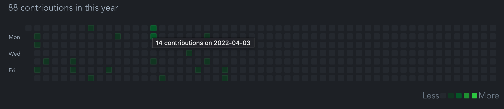

# github-contribution-calendar



## Project setup

```shell
npm install
```

### Compiles and hot-reloads for development

```shell
npm run serve
```

### Compiles and minifies for production

```shell
npm run build
```
